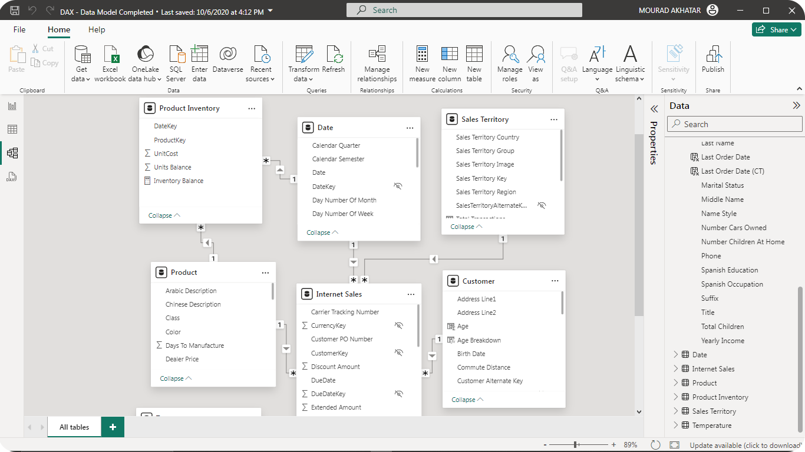
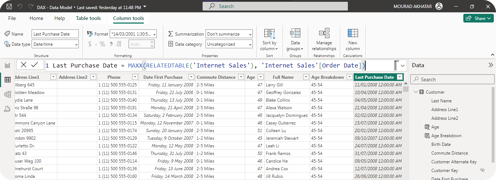
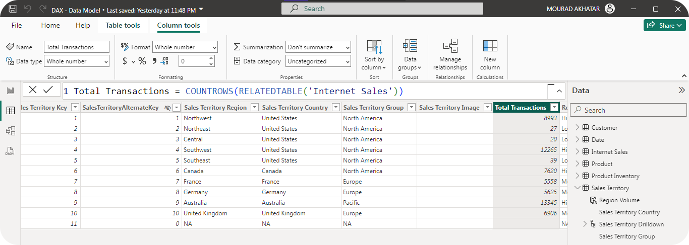

# DAX Language for Power BI & Power Pivot

## Overview

This repository is dedicated to learning and mastering **DAX (Data Analysis Expressions)** language, which is widely used in **Power BI** and **Power Pivot**. DAX is a powerful functional language that allows you to create sophisticated data models, perform complex calculations, and gain deeper insights from your data.

## Sections & Details

I had the opportunity to explore and practice various aspects of the DAX language through the following key topics:

- **Conditions:** Filtering and creating new measures based on specific criteria.
- **Switches:** Handling multiple conditions and outputs using the `SWITCH` function.
- **Filtering:** Using `FILTER` and `FILTERCOLUMNS` functions to filter data based on specific criteria.
- **Measures:** Creating new measures based on contextual calculations using `CALCULATE` and `CALCULATETABLE` functions.
- **Formulas for Aggregation:** Aggregating data with functions like `SUM`, `AVERAGE`, `COUNTROWS`, `COUNT`, `COUNTA`, `SUMX`...
- **Navigation Functions:** Accessing data from related tables with functions like `RELATED`, `LOOKUPVALUE`, `RELATEDTABLE`...
- **Understanding Context:** Managing row and filter contexts in dynamic calculations.
- **Types of Tables:** Creating calculated and summarized tables using DAX functions.
- **Data Modeling:** Building efficient data models with relationships, hierarchies, and joins.

## Demo Screenshots

## Files & Resources for the DAX Language

There are 5 files available in the student files.

- DAX Workshop - Data Model.pbix

This file was created with the September 2020 version of Power BI Desktop. You will need the September 2020 version or later to open this PBIX file.

- DAX Workshop Code Examples.txt

This file contains all the code examples for the Workshop. These code examples can be used to follow along during the class and to review the demos after! Not every example in this file will be reviewed or covered in the short duration of the recording.

- DAX Workshop - Data Model_Completed.pbix

This is the completed version of the Power BI Desktop file with all completed examples. This file was created with the September 2020 version of Power BI Desktop.

- DAX Workshop slides.pdf

This is a PDF version of the slides from the Workshop.

## 🔗 Links

